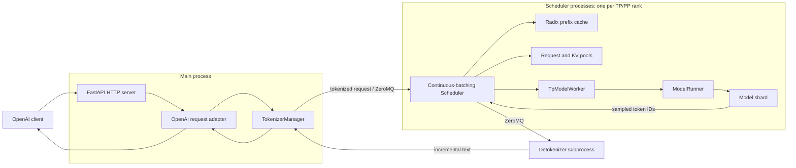

# SGLang Repository Overview

## Ask

> Help me understand this repository, use diagrams if necessary

## Response

SGLang is several related systems in one repository. The central piece is **SRT, the SGLang Runtime**: a multi-process inference engine that performs continuous batching, prefix caching, distributed model execution, and OpenAI-compatible serving.

### Repository Shape

| Area | Responsibility |
|---|---|
| [`python/sglang/srt`](../../python/sglang/srt/server_args.py#L444) | Core autoregressive LLM/VLM serving runtime |
| [`python/sglang/lang`](../../python/sglang/lang/api.py#L23) | SGLang structured-generation DSL: `@function`, `gen`, roles, backends |
| [`python/sglang/kernels`](../../python/sglang/kernels/registry.py) | JIT/AOT operator registry and hardware-specific kernels |
| [`python/sglang/multimodal_gen`](../../python/sglang/multimodal_gen/README.md) | Separate image/video/diffusion inference runtime |
| [`python/sglang/cli`](../../python/sglang/cli/main.py#L12) | `sglang serve`, `generate`, and utility commands |
| [`python/sglang/benchmark`](../../python/sglang/benchmark/serving.py) | Installed benchmark entry points |
| [`rust/`](../) | Native gRPC, multimodal, and optional Rust server extensions |
| [`sgl-model-gateway/`](../../sgl-model-gateway/) | Separate fleet router for regular and prefill/decode workers |
| [`test/registered/`](../../test/registered/) | Custom CI-registered integration, model, kernel, and unit tests |

### Runtime Architecture



The important process detail is that `ModelRunner` is normally **inside each scheduler process**, not another subprocess. With TP=8, there are generally eight scheduler processes, each owning one model shard and participating in distributed collectives.

### One Request, End To End

1. [`python/sglang/cli/serve.py`](../../python/sglang/cli/serve.py#L56) detects whether the model is autoregressive or diffusion. LLMs are sent through [`python/sglang/launch_server.py`](../../python/sglang/launch_server.py#L13).

2. [`ServerArgs`](../../python/sglang/srt/server_args.py#L444) centralizes runtime configuration. [`Engine._launch_subprocesses`](../../python/sglang/srt/entrypoints/engine.py#L1036) starts scheduler ranks and detokenizer workers while keeping `TokenizerManager` in the API process.

3. `/v1/chat/completions` is registered in [`http_server.py`](../../python/sglang/srt/entrypoints/http_server.py#L1702). The chat adapter applies templates, tools, reasoning settings, and sampling options, then builds a `GenerateReqInput` in [`serving_chat.py`](../../python/sglang/srt/entrypoints/openai/serving_chat.py#L998).

4. [`TokenizerManager.generate_request`](../../python/sglang/srt/managers/tokenizer_manager.py#L755) tokenizes and validates the request, records async request state, and sends it to a scheduler over ZeroMQ.

5. The scheduler converts it into a [`Req`](../../python/sglang/srt/managers/schedule_batch.py#L810), performs admission and prefix matching, and creates a [`ScheduleBatch`](../../python/sglang/srt/managers/schedule_batch.py#L1992). Its main loop is [`event_loop_normal`](../../python/sglang/srt/managers/scheduler.py#L1709).

6. [`RadixCache.match_prefix`](../../python/sglang/srt/mem_cache/radix_cache.py#L352) finds the longest reusable token prefix. `ReqToTokenPool` maps requests and positions to physical KV slots in [`memory_pool.py`](../../python/sglang/srt/mem_cache/memory_pool.py#L256).

7. [`TpModelWorker.forward_batch_generation`](../../python/sglang/srt/managers/tp_worker.py#L561) transforms `ScheduleBatch` into a GPU-oriented [`ForwardBatch`](../../python/sglang/srt/model_executor/forward_batch_info.py#L412).

8. [`ModelRunner.forward`](../../python/sglang/srt/model_executor/model_runner.py#L1478) chooses decode CUDA graph, prefill CUDA graph, or eager execution. The last pipeline rank samples the next tokens.

9. `SchedulerOutputStreamer` sends token IDs to the detokenizer. `TokenizerManager.handle_loop()` resolves the waiting async request, and [`serving_chat.py`](../../python/sglang/srt/entrypoints/openai/serving_chat.py#L1481) converts updates into SSE chunks.

The data-shape progression is:

```text
ChatCompletionRequest
  -> GenerateReqInput
  -> TokenizedGenerateReqInput
  -> Req
  -> ScheduleBatch
  -> ForwardBatch
  -> logits / sampled token IDs
  -> detokenized text
  -> OpenAI response or SSE
```

### Core Concepts

- **RadixAttention** is primarily scheduler-side prefix reuse. It is a radix tree over token sequences whose values point to cached KV entries, not a distinct attention formula.
- **Prefill and decode** share a continuously changing batch. Prefill processes new prompt suffixes; decode advances active requests one or more tokens.
- **Attention backends** are selected independently of model implementations through [`attention_registry.py`](../../python/sglang/srt/layers/attention/attention_registry.py#L31).
- **Model discovery** imports modules exposing `EntryClass`; see [`models/registry.py`](../../python/sglang/srt/models/registry.py#L20). Unsupported architectures may fall back to the Transformers implementation.
- **Speculative decoding** wraps the target `TpModelWorker` with an EAGLE, DFlash, DSpark, or n-gram worker inside the scheduler process.
- **Parallelism** includes TP, PP, DP attention, expert parallelism, context parallelism, and elastic EP. These dimensions determine how many scheduler ranks are launched and how weights/attention/expert work are partitioned.
- **PD disaggregation** runs separate prefill and decode server instances and transfers KV state between them. The model gateway can route and coordinate those fleets.

### Common Extension Points

| Change | Start Here |
|---|---|
| Add a model architecture | [`models/registry.py`](../../python/sglang/srt/models/registry.py#L20) and an existing model such as [`llama.py`](../../python/sglang/srt/models/llama.py#L930) |
| Add an attention backend | [`attention_registry.py`](../../python/sglang/srt/layers/attention/attention_registry.py#L31) |
| Add quantization | [`quantization/__init__.py`](../../python/sglang/srt/layers/quantization/__init__.py#L72) |
| Change scheduling policy | [`scheduler.py`](../../python/sglang/srt/managers/scheduler.py#L3006) and [`schedule_batch.py`](../../python/sglang/srt/managers/schedule_batch.py#L1992) |
| Change model loading | [`model_loader/utils.py`](../../python/sglang/srt/model_loader/utils.py#L197) and [`model_loader/loader.py`](../../python/sglang/srt/model_loader/loader.py) |
| Add reasoning/tool parsing | [`reasoning_parser.py`](../../python/sglang/srt/parser/reasoning_parser.py#L1860) and [`function_call_parser.py`](../../python/sglang/srt/function_call/function_call_parser.py#L64) |
| Add hardware support | [`python/sglang/srt/platforms/`](../../python/sglang/srt/platforms/) plus [`python/sglang/srt/hardware_backend/`](../../python/sglang/srt/hardware_backend/) |
| Change packaging | [`python/pyproject.toml`](../../python/pyproject.toml#L1) and [`python/setup.py`](../../python/setup.py#L1) |

### Recommended Reading Order

1. [`python/sglang/cli/serve.py`](../../python/sglang/cli/serve.py#L56)
2. The architecture comment on [`Engine`](../../python/sglang/srt/entrypoints/engine.py#L199)
3. [`http_server.py`](../../python/sglang/srt/entrypoints/http_server.py#L1702) and the chat adapter
4. [`TokenizerManager`](../../python/sglang/srt/managers/tokenizer_manager.py#L374)
5. [`Scheduler`](../../python/sglang/srt/managers/scheduler.py#L378) and `ScheduleBatch`
6. [`TpModelWorker`](../../python/sglang/srt/managers/tp_worker.py#L298) and [`ModelRunner`](../../python/sglang/srt/model_executor/model_runner.py#L285)
7. Radix cache, memory pools, one model implementation, then one attention backend

That path follows a real request and avoids getting lost in the many optional backends and platform branches.