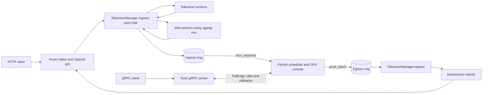

# Repository Overview

## Ask

> Help me understand this repository, use diagrams if necessary

## Response

### Mental Model

This workspace is SGLang's performance-sensitive Rust frontend. It does **not** execute model inference itself. Instead, it handles networking, request validation, tokenization, multimodal preprocessing, detokenization, and efficient communication with the Python GPU scheduler.

| Crate | Responsibility |
|---|---|
| [sglang-server/Cargo.toml](../sglang-server/Cargo.toml#L8-L18) | Native Axum HTTP server, OpenAI compatibility, request FSM, tokenizer/detokenizer workers, and Python scheduler rings |
| [sglang-grpc/Cargo.toml](../sglang-grpc/Cargo.toml#L9-L21) | Independent Tonic gRPC frontend that calls a Python `RuntimeHandle` through PyO3 |
| [sglang-mm/Cargo.toml](../sglang-mm/Cargo.toml#L12-L43) | Image fetching, decoding, resizing, patchification, prompt expansion, and M-RoPE calculations |

`sglang-mm` has two build forms: a Python extension and a pure Rust library linked into `sglang-server` without PyO3 or Rayon.

The HTTP and gRPC paths are sibling frontends. `sglang-grpc` does not call into `sglang-server`.

### HTTP Request Flow

1. An OpenAI handler parses and validates the wire request. For example, `/v1/completions` starts at [sglang-server/src/api_server/openai/completions.rs](../sglang-server/src/api_server/openai/completions.rs#L60).

2. Shared submission code creates a bounded response channel, wraps the payload in an owned `Request`, and sends it to the manager at [sglang-server/src/api_server/submit.rs](../sglang-server/src/api_server/submit.rs#L28).

3. The single ingress thread advances the request through:

   `Received -> Validating -> Normalizing -> Encoding | Tokenizing | PreSendValidating -> Queued`

   The state definitions are in [sglang-server/src/fsm.rs](../sglang-server/src/fsm.rs#L18), while the controlling loop is [sglang-server/src/tokenizer_manager/ingress.rs](../sglang-server/src/tokenizer_manager/ingress.rs#L221).

4. Text enters the tokenizer pool at [sglang-server/src/tokenizer.rs](../sglang-server/src/tokenizer.rs#L186). Images enter the MM pool. Already-tokenized requests skip both.

5. Every generation branch converges on final context-length validation, then serializes into the ingress ring at [sglang-server/src/tokenizer_manager/ingress.rs](../sglang-server/src/tokenizer_manager/ingress.rs#L543).

6. Python calls `Server.recv_requests()` to drain requests and later `Server.push_batch()` to return generated tokens. Those PyO3 boundaries live at [sglang-server/src/lib.rs](../sglang-server/src/lib.rs#L147) and [sglang-server/src/lib.rs](../sglang-server/src/lib.rs#L201).

7. The egress dispatcher decodes each scheduler frame and hashes its request ID to a detokenizer shard at [sglang-server/src/tokenizer_manager/egress.rs](../sglang-server/src/tokenizer_manager/egress.rs#L57).

8. That shard incrementally decodes token deltas and sends `Frame`, `Done`, or `Error` into the handler's response channel at [sglang-server/src/detokenizer.rs](../sglang-server/src/detokenizer.rs#L282). The handler then emits SSE or one accumulated JSON response.

### Important Design Choices

- Requests have one owner at a time. The FSM lives inside [sglang-server/src/message.rs](../sglang-server/src/message.rs#L41), so request-state mutation requires no shared lock.
- The ingress payload separates the MessagePack header from raw `int64` token bytes. This avoids serializing large token arrays through MessagePack; see [sglang-server/src/ring.rs](../sglang-server/src/ring.rs#L47).
- Most channels are bounded. A full ingress ring rejects new work; a full egress ring blocks the scheduler so already-produced output is not dropped.
- Each detokenizer shard owns its own request map. Request-ID hashing chooses a shard, while the complete ID remains the identity.
- Tokio handles HTTP I/O. Dedicated OS threads handle tokenization, detokenization, manager routing, and MM processing. Startup wiring is centralized in [sglang-server/src/runtime.rs](../sglang-server/src/runtime.rs#L124).

### Multimodal Path

The native MM driver follows a fixed pipeline:

`fetch -> decode -> family preprocessing -> token layout -> prompt expansion -> positions`

The model-independent driver is [sglang-mm/src/driver.rs](../sglang-mm/src/driver.rs#L66), and model-specific behavior implements [sglang-mm/src/pipeline.rs](../sglang-mm/src/pipeline.rs#L105). The native server registry currently supports `qwen_vl` only at [sglang-mm/src/registry.rs](../sglang-mm/src/registry.rs#L73).

Large feature tensors do not travel in the normal ingress frame. Workers park them in a request-ID sidecar, optionally using POSIX shared memory, while only expanded token IDs return to the FSM. Python later retrieves them through `Server.take_mm()` at [sglang-server/src/lib.rs](../sglang-server/src/lib.rs#L242).

### Current File

[sglang-server/src/api_server/openai.rs](../sglang-server/src/api_server/openai.rs#L35) is the OpenAI module coordinator, not an endpoint implementation. It:

- Merges model, completion, and chat routes.
- Loads chat-template support.
- Defines OpenAI error shaping.
- Accumulates unary output at [sglang-server/src/api_server/openai.rs](../sglang-server/src/api_server/openai.rs#L141).
- Converges generation requests onto shared submission at [sglang-server/src/api_server/openai.rs](../sglang-server/src/api_server/openai.rs#L183).

A productive reading order is: [runtime.rs](../sglang-server/src/runtime.rs#L124) -> [fsm.rs](../sglang-server/src/fsm.rs#L18) -> [submit.rs](../sglang-server/src/api_server/submit.rs#L28) -> [ingress.rs](../sglang-server/src/tokenizer_manager/ingress.rs#L221) -> [ring.rs](../sglang-server/src/ring.rs#L47) -> [egress.rs](../sglang-server/src/tokenizer_manager/egress.rs#L57) -> [detokenizer.rs](../sglang-server/src/detokenizer.rs#L282).