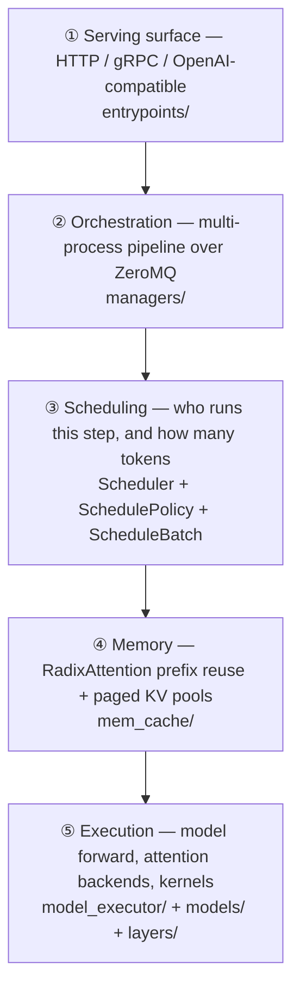
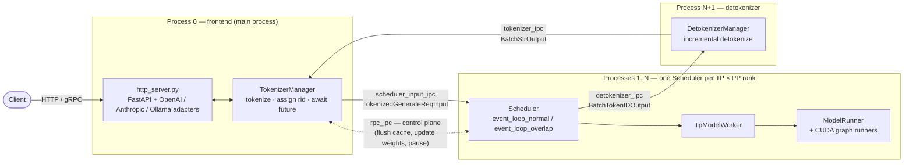
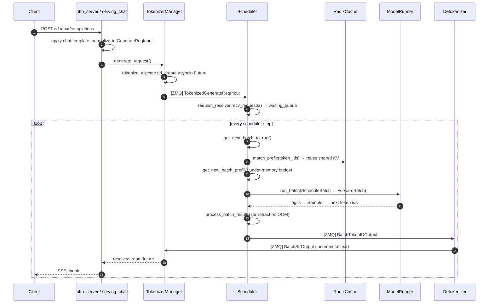
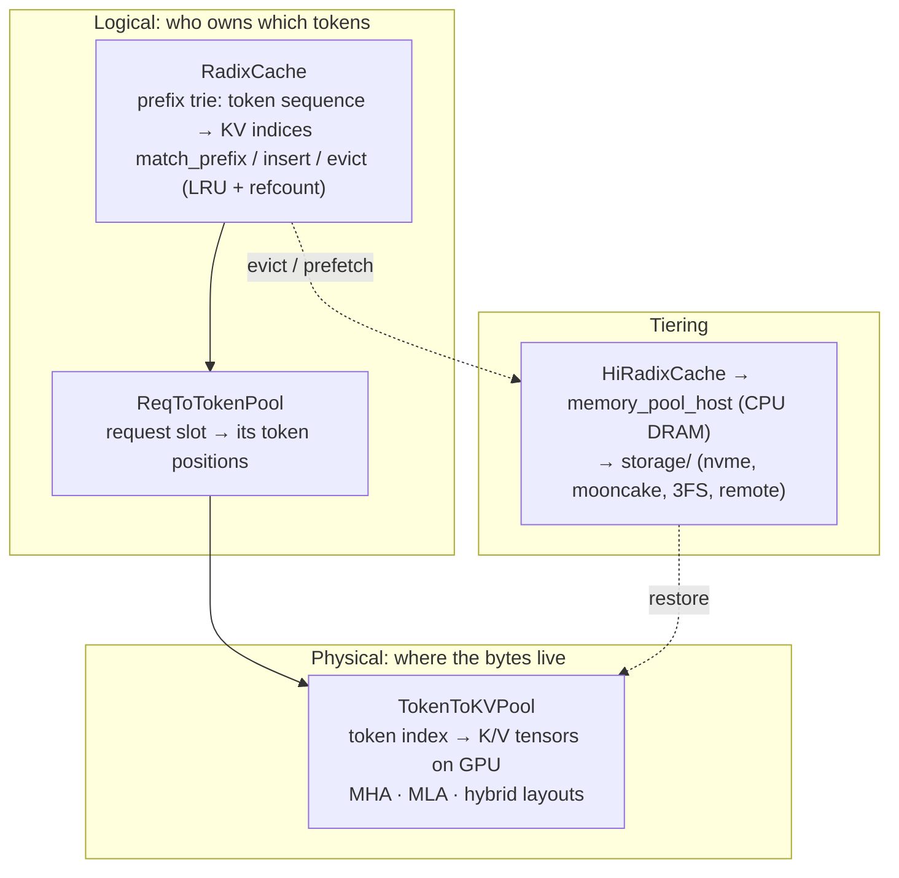
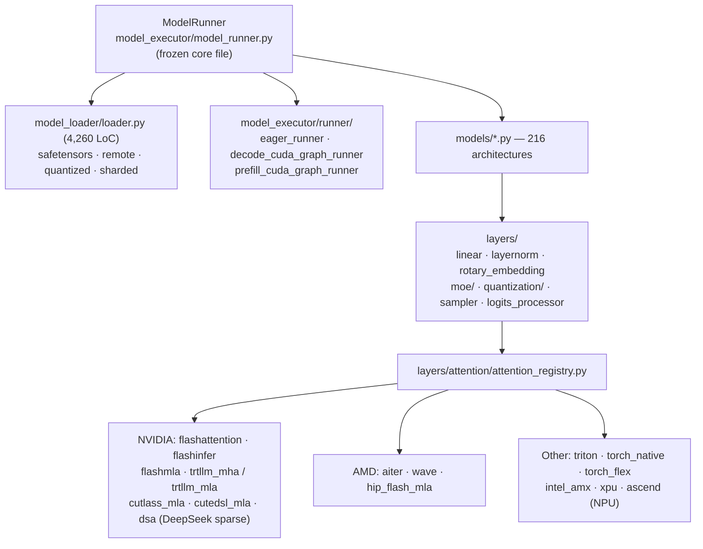
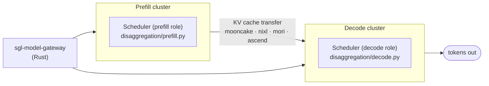
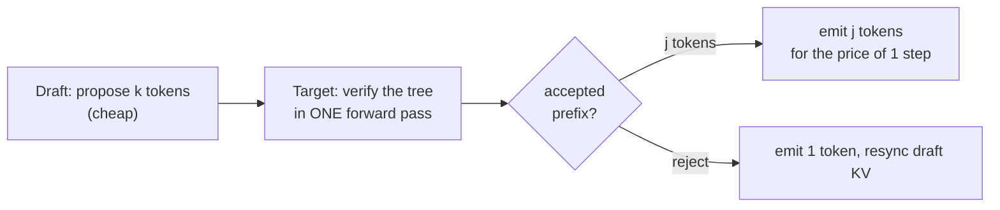
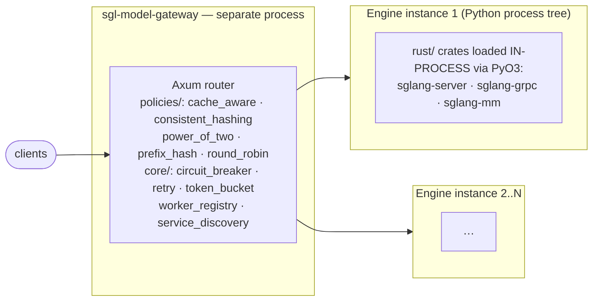

# SGLang — Repository Overview

> Study note captured from a Claude Code session.
> Repository: `/Users/WChen/AI/sglangTry/sglang`
> Branch: `study` @ `687967c70d`
> Model: Claude Opus 5 (1M context) — `claude-opus-5[1m]`
> Date: 2026-08-12
>
> Note: `study/repo-overview_opus5.md` already existed from an earlier session with the
> same model. This file is a separate, independently-derived pass — the earlier one was
> left untouched.

---

## The ask

> Help me understand the repository /Users/WChen/AI/sglangTry/sglang, use diagrams if
> necessary, save my ask and your response in a MD file with your model name at end of
> file name under study directory.

---

## The response

SGLang is a **serving engine for LLMs, VLMs and diffusion models** — the layer that sits
between an HTTP request and a GPU. It is not a training framework and not a model zoo; it
is a scheduler, a KV-cache manager, and a kernel-dispatch layer, with 216 model
definitions attached to it.

Scale of the thing, measured on this checkout:

| Area | Size |
|---|---|
| `python/sglang/srt/` (the runtime) | **674,142 LoC** of Python |
| `sgl-model-gateway/` (Rust router) | 7,229 files |
| `test/` | 1,882 files |
| `python/sglang/srt/models/` | 216 model files |
| `python/sglang/srt/layers/` | 311 files |

---

## 1. The mental model: five concentric rings

Before any file paths, get the shape right. SGLang is best understood as five rings, each
of which you can study in isolation.



Almost every feature in the repo is an elaboration of one of these rings. Speculative
decoding elaborates ③+⑤. PD disaggregation elaborates ②+④. Quantization elaborates ⑤.
LoRA elaborates ④+⑤.

---

## 2. Top-level layout

| Path | What it is |
|---|---|
| `python/sglang/srt/` | **SRT = SGLang RunTime.** The engine. 674k LoC. This is the repo. |
| `python/sglang/lang/` | The original *frontend DSL* (`gen`, `select`, `fork`) — the thing SGLang was originally named for. Small, and largely orthogonal to modern usage. |
| `python/sglang/bench_*.py` | First-class benchmarking entry points (`bench_serving`, `bench_one_batch`, `bench_offline_throughput`). Used constantly in PRs. |
| `rust/` | Three PyO3 extension crates loaded *into* the Python process: `sglang-server` (HTTP fast path), `sglang-grpc`, `sglang-mm` (multimodal preprocessing). Rust 2024 edition. |
| `sgl-model-gateway/` | A **separate Rust process** that fronts N engine instances — cache-aware load balancing, PD routing, service discovery, circuit breaking. |
| `test/` | Test suites; `test/run_suite.py` is the CI driver. |
| `docs/`, `benchmark/`, `examples/`, `docker/`, `3rdparty/` | Supporting material. `docs/` is a Mintlify site (`docs.json`). |
| `.claude/rules/`, `.claude/skills/` | **Mandatory-reading contribution rules and 20+ task cookbooks.** Unusual and genuinely useful — see §11. |

---

## 3. Process architecture — the single most important diagram

SGLang is **not a monolith**. One logical "server" is a pipeline of OS processes wired
together with ZeroMQ IPC sockets. Launch happens in
`python/sglang/srt/entrypoints/engine.py:1036` — `Engine._launch_subprocesses`.



Three things to internalize:

1. **The wire contract is `managers/io_struct.py`.** Every message crossing a ZMQ socket
   is a `msgspec.Struct` declared there — `TokenizedGenerateReqInput`,
   `BatchTokenIDOutput`, `BatchStrOutput`, plus ~60 control-plane request/response pairs
   (`FlushCacheReqInput`, `UpdateWeightsFromTensorReqInput`,
   `ReleaseMemoryOccupationReqInput`, …). Read this file first; it is the vocabulary of
   the entire system. Note `msgspec`, not `pickle` — serialization cost is on the hot path.

2. **Why split processes at all.** Tokenization and detokenization are CPU-bound Python.
   Keeping them out of the scheduler process means the GIL in the scheduler process is
   never contended by string work, so the GPU-feeding loop stays tight. This is the
   mechanical basis of the "zero-overhead batch scheduler" claim.

3. **`Engine` is the same thing without HTTP.** `entrypoints/engine.py` gives you an
   embeddable, in-process form used by RL trainers (verl, slime, Miles, AReaL). The HTTP
   server is a thin wrapper over it. There is also `srt/ray/` for a Ray-actor-based
   deployment of the same topology.

Port/socket names live in `PortArgs` in `server_args.py`: `tokenizer_ipc_name`,
`scheduler_input_ipc_name`, `detokenizer_ipc_name`, `rpc_ipc_name`, `metrics_ipc_name`.

---

## 4. Request lifecycle, end to end



### The two event loops

`managers/scheduler.py:1709` `event_loop_normal` and `:1744` `event_loop_overlap`.

`event_loop_normal` is the readable version — receive, plan, run, process, repeat:

```python
while True:
    recv_reqs = self.request_receiver.recv_requests()
    self.process_input_requests(recv_reqs)
    plan  = self.get_next_batch_to_run(running_batch=..., last_batch=...)
    batch = plan.batch_to_run
    if batch:
        result = self.run_batch(batch)
        self.process_batch_result(batch, result)   # ← blocks on GPU
    else:
        self.on_idle()
    self.last_batch = batch
```

`event_loop_overlap` is the one that actually runs in production. It defers
`process_batch_result` by one iteration via a `result_queue: deque`, so the CPU plans
step *N+1* while the GPU is still executing step *N*:

```python
plan  = self.get_next_batch_to_run(...)
batch = plan.batch_to_run
if batch:
    batch_result = self.run_batch(batch)      # launch, do not sync
    self._apply_war_barrier()                 # fence vs. this forward's reads
    self.result_queue.append((batch.copy(), batch_result))
if self.last_batch:
    pop_and_process()                         # now handle step N-1
```

That one-step skew is where most of SGLang's throughput advantage comes from. Note
`batch.copy()` — the deferred result must not observe later mutations, which is exactly
why `.claude/rules/schedule-batch-out-of-place-mutation.md` exists.

---

## 5. The Scheduler

`managers/scheduler.py` — 5,067 lines, and the class you will spend the most time in.

**Its `__init__` is a deliberately flat sequence of `init_*` calls** — I counted ~40 of
them: `init_model_config`, `init_ipc_channels`, `init_tokenizer`, `init_tp_model_worker`,
`init_memory_pools`, `init_all_attention_backends`, `init_all_cuda_graphs`,
`init_chunked_prefill`, `init_schedule_policy`, `init_disaggregation`, `init_overlap`,
`init_grammar_manager`, `init_request_receiver`, `init_output_streamer`,
`init_batch_result_processor`, … This is a codified house style (see the
`large-class-style` skill), not accidental sprawl. When you add a feature, you add an
`init_x()` and a component — you do not inline 200 more lines.

Delegated logic lives in `managers/scheduler_components/`:

```
request_receiver · output_streamer · output_sender · batch_result_processor
logprob_result_processor · weight_updater · metrics_reporter · memory_usage
invariant_checker · pool_stats_observer · kv_events_publisher · load_inquirer
new_token_ratio_tracker · idle_sleeper · profiler_manager · dp_attn · ipc_channels
```

### Core batching types (`managers/schedule_batch.py`, 3,391 lines)

| Type | Side | Role |
|---|---|---|
| `Req` | CPU | One request: token ids, sampling params, cache refs, finish state |
| `ScheduleBatch` | CPU | A batch of `Req`s being *planned* — mutable, merged, filtered, retracted |
| `ForwardBatch` | GPU | Flattened tensors ready for the model (`model_executor/forward_batch_info.py`) |
| `ForwardMode` | — | `EXTEND` (prefill) · `DECODE` · `MIXED` · `IDLE` · `TARGET_VERIFY` / `DRAFT_EXTEND` (spec) · `SPLIT_PREFILL` · `DLLM_EXTEND` |

### What `get_next_batch_to_run` actually does (`scheduler.py:3006`)

Reading it top to bottom is the fastest way to understand SGLang's scheduling policy:

1. Abort requests past their waiting/running timeout.
2. Pull the **chunked request** out of the last batch (chunked prefill splits one long
   prompt across several steps) and stash its KV into the cache.
3. Merge the previous *extend* batch into `running_batch` — prefill graduates to decode.
4. Filter finished requests out of prefill-only batches.
5. Try to form a **new prefill batch** (`get_new_batch_prefill`, `:3148`). If one exists,
   run it; prefill has priority over decode.
6. Otherwise run a **decode** step on `running_batch`.

Special-cased branches for `dllm` (diffusion LLM) and `hisparse` (hierarchical sparse
attention) are threaded through the same function.

`managers/schedule_policy.py` decides the *order* of the waiting queue — LPM
(longest-prefix-match, cache-aware), FCFS, priority, DFS-weight.

---

## 6. Memory & KV cache — RadixAttention

SGLang's signature contribution. `mem_cache/` — 117 files.



The **three levels of indirection** are the whole trick: many requests can point at the
same physical KV pages, so a shared system prompt is stored once. Eviction is refcounted —
a node cannot be evicted while a live request references it.

Variants you will meet:

- `radix_cache.py` — the baseline trie. `radix_cache_cpp.py` + `cpp_radix_tree/` — the C++
  implementation for lower CPU overhead at high QPS.
- `swa_radix_cache.py`, `pure_swa_radix_cache.py` — sliding-window attention models, where
  old KV is discardable by construction.
- `mamba_radix_cache.py`, `mamba_checkpoint_pool.py` — linear-attention / SSM state, which
  is a fixed-size *state* rather than a growing KV sequence.
- `hiradix_cache.py` + `storage/` — **HiCache**, the multi-tier offload path.
- `unified_radix_cache.py` / `unified_memory_pool.py` / `kv_vmm_backing.py` — newer
  CUDA-VMM-backed pooling that lets the allocator compact and resize physical memory.
- `memory_pool.py` (5,011 lines) — the physical pools themselves.

---

## 7. Model execution



Key facts:

- **`model_runner.py` is a declared frozen core file.** Edits require reading the
  `large-class-style` skill first; helpers were deliberately extracted into
  `model_runner_components/`.
- **216 models, one file each.** A model file is a self-contained `nn.Module` plus a
  weight-name mapping. Adding a model is genuinely "one file + a registry entry" — there
  is a `cookbook-add-model` skill with templates. The heavy ones (`deepseek_v4.py` 3,385
  LoC, `kimi_k3.py` 3,337, `deepseek_v2.py` 3,252) are large because MLA + MoE + expert
  parallelism specialization all land in the model file.
- **Attention is a plugin registry.** This is how a single codebase covers NVIDIA, AMD,
  Intel, Google TPU (via sglang-jax), and Ascend NPU. `hardware_backend/` holds the
  per-vendor trees; `platforms/` does capability detection.
- **CUDA graphs** are captured per batch-size bucket for decode (and, increasingly,
  prefill) to remove kernel-launch overhead — decode steps are tiny and launch-bound.
- **Quantization** lives in `layers/quantization/`: FP8 (2,716 LoC), NVFP4/ModelOpt
  (2,878), AWQ, GPTQ, INT4, torchao, blockwise variants.

---

## 8. Parallelism & distributed serving

| Dimension | Where | Note |
|---|---|---|
| Tensor parallel (TP) | `distributed/parallel_state.py` (3,041 LoC), `layers/linear.py` | Splits weights within a layer |
| Data parallel (DP) | `managers/data_parallel_controller.py`, `layers/dp_attention.py` | Replicas; DP-attention shards the *sequence* dim for MLA models |
| Pipeline parallel (PP) | `managers/scheduler_pp_mixin.py` | Microbatches across layer stages |
| Expert parallel (EP) | `layers/moe/`, `eplb/`, `elastic_ep/` | `eplb/` = expert-parallel load balancer; rebalances hot experts at runtime |
| Context / sequence parallel | `layers/cp/`, `layers/dcp/` | Long-context sharding |
| **PD disaggregation** | `disaggregation/` | See below |

### PD disaggregation

The most architecturally significant of these. Prefill is *compute*-bound; decode is
*memory-bandwidth*-bound. Running both on the same GPUs means neither is saturated, and
long prefills stall decode (head-of-line blocking).



Transports are pluggable subpackages: `disaggregation/mooncake/`, `nixl/` (3,062 LoC in
`conn.py` alone), `mori/`, `ascend/`, plus `fake/` for testing. There is also a separate
**encode** role (`encode_server.py`, 4,557 LoC) that disaggregates multimodal vision
encoding onto its own pool.

---

## 9. Speculative decoding

`speculative/` — a subsystem with several algorithm families behind one interface
(`base_spec_worker.py`, dispatched by `spec_registry.py`).



Families present:

- **EAGLE** (`eagle_worker_v2.py`) and **multi-layer EAGLE** — a small draft head proposes
  a *token tree*; the target verifies all branches in one batched pass.
- **DFlash v1/v2** (`dflash_worker_v2.py`) — the current-generation approach.
- **N-gram** (`ngram_worker.py` + `cpp_ngram/`) — model-free drafting from the prompt/corpus;
  extremely cheap, great for code and repetitive text. `external_corpus_manager.py` lets
  you attach a drafting corpus at runtime.
- **Frozen-KV MTP** (`frozen_kv_mtp_worker_v2.py`) — multi-token-prediction heads
  (DeepSeek-style).
- **Standalone** and **DSpark** (`dspark_components/`).
- `adaptive_spec_params.py` — tunes the speculation depth at runtime based on measured
  accept rate, which matters because bad speculation is a *net loss*.

Each family carries its own CUDA-graph runner because verify batches have a different
shape than plain decode. This area has an enforced naming convention — the
`speculative-naming` skill.

---

## 10. The serving surface, and everything bolted onto it

**Entry points** (`entrypoints/`):
- `http_server.py` (2,779 LoC) — FastAPI. Native `/generate` plus OpenAI-compatible
  `entrypoints/openai/` (`serving_chat` 2,578 LoC, `serving_completions`,
  `serving_responses` 2,593 LoC, `serving_embedding`, `serving_rerank`).
- `entrypoints/anthropic/` and `entrypoints/ollama/` — additional API dialects.
- `grpc_server.py` + `grpc_bridge.py` + `proto/`.
- `http_server_engine.py` — engine-as-a-library over HTTP, used by RL frameworks.

**Feature modules hanging off the runtime:**

| Module | What it gives you |
|---|---|
| `constrained/` | Structured output — xgrammar, outlines, llguidance backends for JSON-schema / regex / EBNF |
| `function_call/` | Per-model tool-call parsers (39 files — every model family formats tool calls differently) |
| `lora/` | Runtime LoRA adapter load/unload with batched multi-adapter kernels |
| `multimodal/` | Image/video/audio processors; `mm_schedule.py` schedules encode work |
| `multiplex/` | pd-mux — time-slicing prefill and decode on the *same* GPU (SM partitioning) |
| `dllm/` | Diffusion LLMs (LLaDA-style) — a genuinely different decode loop |
| `eplb/`, `elastic_ep/` | Expert load balancing; elastic scale-up/down of EP ranks |
| `weight_sync/`, `weight_cache/`, `checkpoint_engine/` | RL weight-update paths: `update_weights_from_tensor` / `_distributed` / `_ipc` push new weights in-place with no restart |
| `observability/` | Metrics, tracing, KV events |
| `kv_canary/` | A KV-correctness fuzzing/verification harness — perturbs the cache and checks token-level output invariance |
| `state_capturer/`, `debug_utils/` | Dump and replay forward state for debugging (91 files in `debug_utils/`) |
| `connector/`, `session/` | External KV connectors; multi-turn session state |

### Configuration

- **`server_args.py` — 9,840 lines**, one giant `ServerArgs` dataclass holding every CLI
  flag, with `__post_init__` validation and derivation. It is the largest file in the repo
  and the de-facto index of every feature.
- `arg_groups/overrides.py` (2,706 LoC) — model-family-specific default overrides
  (DeepSeek V4, Kimi K3, hisparse, PD, spec decoding).
- `runtime_context.py` — a tiered `RuntimeContext` published once per process, replacing
  ad-hoc module globals. Guarded by CI and the `sglang-runtime-context` skill.
- `environ.py` — every `SGLANG_*` env var, centrally declared.

---

## 11. The Rust side

Two distinct things, easy to confuse:



- **`rust/`** — PyO3 extension modules that run *inside* the Python engine process, moving
  the HTTP/gRPC accept loop and multimodal preprocessing off Python.
- **`sgl-model-gateway/`** — a standalone reverse proxy in front of many engines. Its
  killer feature is **cache-aware routing** (`policies/cache_aware.rs`, `tree.rs`,
  `prefix_hash.rs`): it maintains an approximate view of each worker's radix tree and
  routes a request to the worker most likely to already hold its prefix. It also owns PD
  routing (`routers/`), MCP support, and Kubernetes service discovery.

---

## 12. Contribution rules baked into the repo

This checkout carries an unusually strong set of machine-readable conventions. Read these
before your first edit — CI enforces several of them.

`.claude/rules/`:
- `modify-component-must-read.md` — a table mapping components (Scheduler,
  TokenizerManager, ModelRunner, speculative decoding, env vars) to skills you must read first.
- `general-code-style.md`, `no-dataclasses.md` (prefer `msgspec.Struct` on hot paths),
  `no-getattr-defensive.md` (no `getattr(x, "y", default)` papering over missing attrs),
  `schedule-batch-out-of-place-mutation.md`, `forward-batch-init-new-purity.md`,
  `unit-test-admission.md`.

`.claude/skills/` — 22 task cookbooks, the most useful of which are `cookbook-add-model`,
`cookbook-review-pr`, `add-sgl-kernel` / `add-jit-kernel`, `debug-cuda-crash`,
`debug-distributed-hang`, `sglang-bisect-ci-regression`, `write-sglang-test`,
`large-class-style`.

---

## 13. Suggested reading order

If you have a day:

1. **`managers/io_struct.py`** — the vocabulary. Skim `GenerateReqInput`,
   `TokenizedGenerateReqInput`, `BatchTokenIDOutput`, `BatchStrOutput`.
2. **`entrypoints/engine.py:1036`** `_launch_subprocesses` — how the topology comes up.
3. **`managers/scheduler.py:1709`** `event_loop_normal`, then `:3006`
   `get_next_batch_to_run`, then `:3148` `get_new_batch_prefill`, then `:3617` `run_batch`.
4. **`managers/schedule_batch.py`** — `Req` and `ScheduleBatch`.
5. **`mem_cache/radix_cache.py`** — `match_prefix` / `insert` / `evict`. This is the paper.
6. **`model_executor/model_runner.py`** → **`models/llama.py`** as the reference
   architecture, then `layers/attention/flashattention_backend.py` for one concrete backend.

If you have an hour: read §3, §4 and §6 of this document, then `io_struct.py` and
`event_loop_normal`.

---

## 14. Where things tend to go wrong (orientation for debugging)

| Symptom | Look here first |
|---|---|
| OOM / "retracted" requests in the log | `scheduler.py` retraction path, `mem_cache/memory_pool.py` sizing, `--mem-fraction-static` |
| Low throughput, GPU underutilized | overlap mode disabled? `is_disable_overlap_for_batch`; CUDA graph capture failing; chunked-prefill size |
| Wrong output vs. HF reference | attention backend mismatch, quantization path, `kl-consistency-test` skill |
| Hang on multi-GPU launch | `distributed/parallel_state.py`, NCCL env, `debug-distributed-hang` skill |
| Prefix cache not hitting | `schedule_policy.py` ordering (needs LPM), gateway routing policy, radix eviction pressure |
