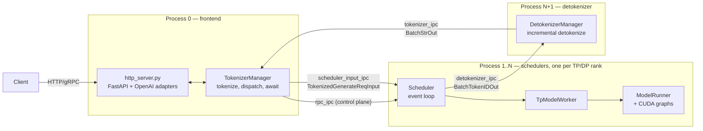
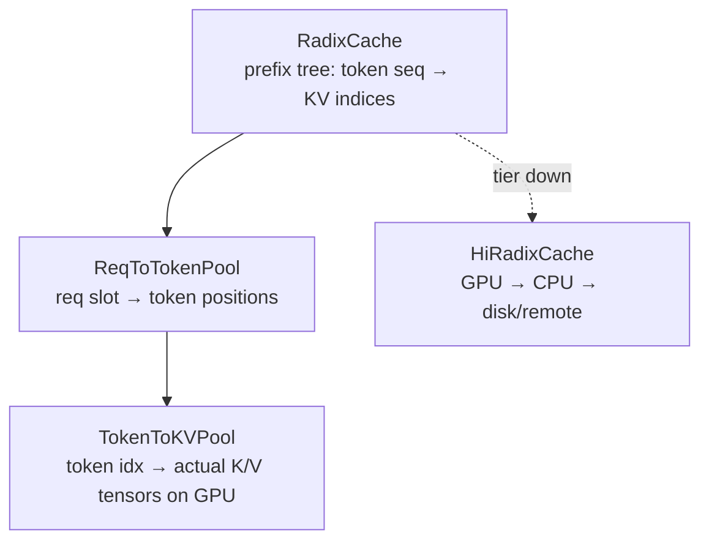
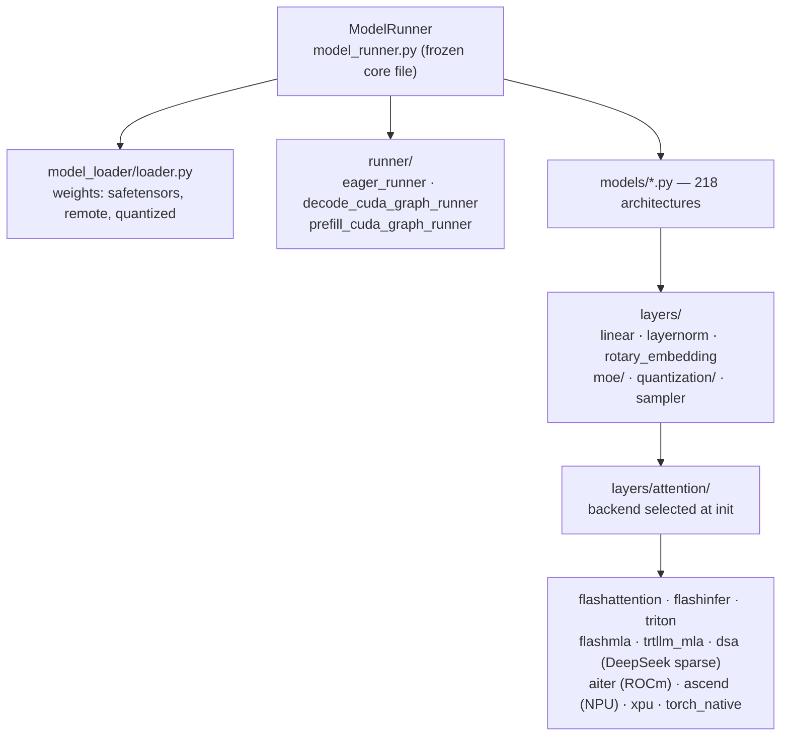

# SGLang — Repository Overview

> Study note captured from a Claude Code session.
> Working directory: `/Users/WChen/AI/sglangTry/sglang`
> Branch: `study` @ `687967c70d`
> Model: Claude Opus 5 (1M context)

---

## The ask

> Help me understand the repository /Users/WChen/AI/sglangTry/sglang, use diagrams if necessary

---

## The response

SGLang is a **serving engine for LLMs / VLMs / diffusion models**. It's ~675k lines of Python in the runtime alone, plus Rust components. Here's how it decomposes.

### 1. Top-level layout

| Path | What it is |
|---|---|
| `python/sglang/srt/` | **SRT = SGLang RunTime.** The actual inference engine. ~675k LoC, the heart of the repo. |
| `python/sglang/lang/` | The original *frontend DSL* (`gen`, `select`, `fork`) — `ir.py`, `interpreter.py`. Small (~4.6k LoC) and largely legacy relative to srt. |
| `rust/` | Rust accelerators loaded into the Python process: `sglang-server` (HTTP fast path), `sglang-grpc`, `sglang-mm` (multimodal preprocessing). |
| `sgl-model-gateway/` | Standalone Rust **router/gateway** (~116k LoC) — cache-aware load balancing, PD disaggregation routing, service discovery. A separate process in front of N engines. |
| `test/` | ~420k LoC. `test/srt/` is the bulk; `test/run_suite.py` drives CI suites. |
| `benchmark/`, `docs/`, `examples/`, `docker/`, `3rdparty/` | Supporting material. |

### 2. Process architecture

The single most important thing to internalize: **SGLang is a multi-process pipeline connected by ZeroMQ**, not a monolith. Launch happens in `engine.py:1036 _launch_subprocesses`.



- The ZMQ endpoint names are defined in `PortArgs` at `server_args.py:9668` — `tokenizer_ipc_name`, `scheduler_input_ipc_name`, `detokenizer_ipc_name`, `rpc_ipc_name`, `metrics_ipc_name`.
- All messages crossing these sockets are dataclasses in `managers/io_struct.py`. That file is the **wire contract** — read it early.
- Why split processes: tokenization/detokenization are CPU-bound Python; keeping them off the scheduler process keeps the GPU loop free of GIL contention. This is the "zero-overhead batch scheduler" idea.
- `Engine` (`entrypoints/engine.py:199`) is the embeddable (no-HTTP) form of the same thing; the HTTP server just wraps it.

### 3. Request lifecycle

```
POST /v1/chat/completions
  → entrypoints/openai/serving_chat.py      normalize to internal request
  → TokenizerManager                        tokenize, assign rid, create asyncio future
  → [ZMQ] → Scheduler.event_loop_*          recv, admit to waiting queue
       ├─ SchedulePolicy                    order queue (LPM / FCFS / priority)
       ├─ get_new_batch_prefill()           form a prefill batch under memory budget
       ├─ RadixCache.match_prefix()         reuse KV of shared prefixes
       ├─ run_batch() → TpModelWorker → ModelRunner.forward()
       │      ForwardBatch → model → attention backend → logits
       ├─ Sampler                           sample next token
       └─ process_batch_result()            stream out, or retract on OOM
  → [ZMQ] → DetokenizerManager              incremental detokenize
  → [ZMQ] → TokenizerManager                resolve future
  → SSE chunk to client
```

The two event loops are `event_loop_normal` (`scheduler.py:1709`) and `event_loop_overlap` (`scheduler.py:1744`). Overlap mode runs CPU scheduling for step N+1 while the GPU executes step N — this is where most of the throughput comes from.

### 4. The Scheduler

`managers/scheduler.py` is 5,067 lines and the class you'll spend the most time in. Its `__init__` is deliberately written as a flat sequence of `init_*` calls (`init_model_config`, `init_memory_pools`, `init_all_attention_backends`, `init_overlap`, `init_disaggregation`, …) — that orchestration style is a codified convention here, see the `large-class-style` skill referenced by `.claude/rules/modify-component-must-read.md`.

Delegated helpers live in `managers/scheduler_components/`: `request_receiver`, `output_streamer`, `batch_result_processor`, `weight_updater`, `metrics_reporter`, `invariant_checker`, etc. When adding scheduler functionality, the convention is a new component here rather than another 200 lines in the class.

Key batching concepts, all in `schedule_batch.py`:
- **`Req`** — one request, its token ids, sampling params, cache references.
- **`ScheduleBatch`** — CPU-side batch of `Req`s being planned.
- **`ForwardBatch`** (`model_executor/forward_batch_info.py`) — GPU-side, flattened tensors ready for the model.
- **`ForwardMode`** — `EXTEND` (prefill), `DECODE`, `MIXED`, `IDLE`, `TARGET_VERIFY` / `DRAFT_EXTEND` (spec decoding), `SPLIT_PREFILL`, `DLLM_EXTEND`.

### 5. Memory & KV cache — RadixAttention

This is SGLang's signature contribution and lives in `mem_cache/`.



Three layers of indirection let many requests share one physical KV region:

- `radix_cache.py` — the prefix trie with LRU eviction. Variants: `swa_radix_cache.py` (sliding-window), `mamba_radix_cache.py` (linear-attention state), `radix_cache_cpp.py` (C++ impl in `cpp_radix_tree/`).
- `memory_pool.py` (5,011 lines) — the physical pools, per KV layout (MHA / MLA / hybrid).
- `hiradix_cache.py` + `storage/` — **HiCache**, multi-tier offload to host RAM and external stores.

### 6. Model execution



- `model_executor/model_runner.py` is marked a **frozen core file** — edits require reading the `large-class-style` skill. Its helpers were extracted to `model_runner_components/`.
- **Models**: 218 files in `models/`. Each is a self-contained `nn.Module` + weight-loading map. Adding a model = one file + registry entry. The big ones (`deepseek_v4.py`, `kimi_k3.py`) run 3k+ lines because of MLA/MoE/EP specialization.
- **Attention backends** are pluggable via `layers/attention/attention_registry.py` — this is how one codebase covers NVIDIA, AMD, Ascend NPU, Intel XPU, and CPU.
- **CUDA graphs**: captured per batch-size bucket in `model_executor/runner/` to eliminate launch overhead in decode.

### 7. Parallelism & distributed serving

| Dimension | Where |
|---|---|
| Tensor parallel (TP) | `distributed/parallel_state.py`, `layers/linear.py` |
| Data parallel (DP) | `managers/data_parallel_controller.py`; DP attention in `layers/dp_attention.py` |
| Pipeline parallel (PP) | `managers/scheduler_pp_mixin.py` |
| Expert parallel (EP) + load balancing | `layers/moe/`, `eplb/`, `elastic_ep/` |
| Context parallel | `layers/cp/`, `layers/dcp/` |
| **PD disaggregation** | `disaggregation/` — separate prefill and decode clusters, KV shipped over `mooncake` / `nixl` / `mori` transports |

PD disaggregation is worth calling out: `disaggregation/prefill.py` and `disaggregation/decode.py` split the two phases onto different GPU pools with different parallelism, since prefill is compute-bound and decode is memory-bound.

### 8. Speculative decoding

`speculative/` is a large subsystem with several algorithm families sharing a worker interface (`base_spec_worker.py`, dispatched via `spec_registry.py`):

- **EAGLE / multi-layer EAGLE** — draft model proposes a token tree, target verifies in one pass.
- **DFlash** (v1/v2) and **Spec V2** — the newer generation.
- **N-gram** (`ngram_worker.py`, C++ in `cpp_ngram/`) — model-free drafting.
- **Frozen-KV MTP**, **standalone**, **DSpark**.

Each has its own CUDA graph runner because verify batches have different shapes than plain decode. Note this area has a dedicated naming convention (`speculative-naming` skill) enforced by the project rules.

### 9. Configuration

- `server_args.py` — 9,840 lines, the single `ServerArgs` dataclass holding every CLI flag. Post-init logic derives and validates defaults.
- `arg_groups/overrides.py` — model-family-specific default overrides (DeepSeek V4, Kimi K3, hisparse, PD, spec decoding hooks).
- `runtime_context.py` — a tiered `RuntimeContext` published once per process (`publish(server_args, role=...)`) replacing ad-hoc module globals. There's a `sglang-runtime-context` skill and CI guardrails around this; read it before touching `server_args` or any module-level state.
- `environ.py` — all `SGLANG_*` env vars, centrally declared (see `env-var-conventions` skill).

### 10. Serving surface

- **HTTP**: `entrypoints/http_server.py` plus OpenAI-compatible adapters in `entrypoints/openai/` (`serving_chat`, `serving_completions`, `serving_responses`, `serving_embedding`). Also `entrypoints/anthropic/` and `entrypoints/ollama/` shims.
- **gRPC**: `entrypoints/grpc_server.py` + `proto/`.
- **Constrained decoding**: `constrained/` — xgrammar / outlines / llguidance backends for JSON-schema and regex output.
- **Function calling**: `function_call/` — per-model tool-call parsers.
- **LoRA**: `lora/` — runtime adapter load/unload with batched LoRA kernels.
- **RL integration**: weight update paths (`update_weights_from_tensor` / `_distributed` / `_ipc`) on the Engine let a trainer push new weights in-place without restart.

### Suggested reading order

1. `managers/io_struct.py` — the vocabulary of the system.
2. `entrypoints/engine.py:1036` — how the processes come up.
3. `managers/scheduler.py:1709` `event_loop_normal` → `get_next_batch_to_run` → `run_batch`.
4. `managers/schedule_batch.py` — `Req` and `ScheduleBatch`.
5. `mem_cache/radix_cache.py` — `match_prefix` / `insert` / `evict`.
6. `model_executor/model_runner.py` → a small model like `models/llama.py` as a reference architecture.

One practical note: this checkout has project rules at `.claude/rules/modify-component-must-read.md` mandating specific skills before editing `Scheduler`, `TokenizerManager`, `ModelRunner`, speculative decoding, or env vars. Worth reading before your first change.
